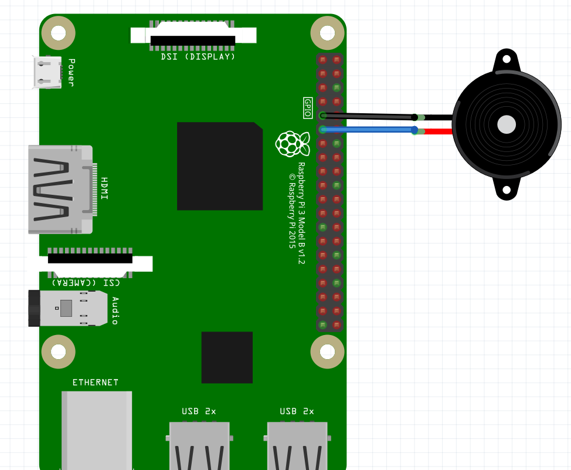
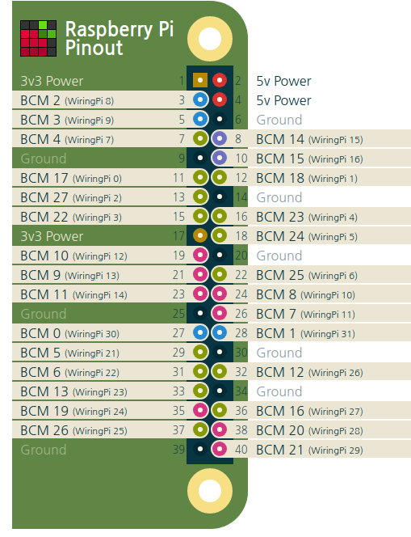

# raspberrypi_otto_tone_play

## 동작 영상

## 테스트
<pre>
<code>
$ git clone https://github.com/chandong83/raspberrypi_otto_tone_play
$ cd raspberrypi_otto_tone_play
$ python test.py
</code>        
</pre>

##
<pre>
라즈베리 파이                <>     Buzzer
#1, 9Pin GND               -       -
#2, 11Pin BCM17            -       +
</pre>

